# Self-Healing RAG Is a Protocol, Not a Model

**Treat retrieval failure as observable state. Repair it with transactions. Commit only verified improvement. Roll back everything else.**

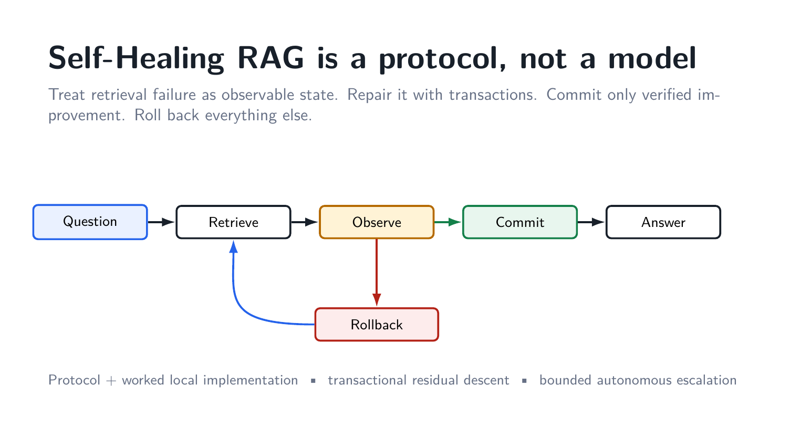

Retrieval-augmented generation is usually drawn as a straight line: ask a question, retrieve a few chunks, put those chunks into a prompt, and generate an answer. That diagram is useful until retrieval fails. Then the abstraction has almost nothing to say.

What should the system do when one operand is missing? What if a rewritten query finds a new passage but loses a passage that was already essential? What if a repair returns to a state that the system saw three steps ago? What exactly counts as an improvement? When should the system stop trying?

Those are not primarily language-model questions. They are **control questions**.

That is the idea behind the Self-Healing RAG project. The central object is not a new LLM and not a dataset. It is a protocol for controlling the evolution of retrieved evidence. A particular retriever, vector database, generator, verifier, or benchmark can instantiate the protocol, but none of them defines it.

The first proof-of-concept implementation deliberately made the control machinery explicit, even when that made the system slower than it should be. That exposed the important invariants: durable state, requirement-level residuals, guarded repair, commit/rollback, cycle detection, checkpoints, and bounded terminal states. The subsequent implementation direction compresses the expensive LLM call graph while retaining those invariants.

This article explains the protocol first and the implementation second.

> **Smallest useful definition:** self-healing RAG is observable retrieval failure + targeted repair + independent verification + commit/rollback + finite termination.

The repositories are here:

- Protocol and complete v0.1 proof-of-concept lineage: <https://github.com/AngshulMajumdar/Self-Healing-RAG>
- Compact from-scratch v0.2 implementation direction: <https://github.com/AngshulMajumdar/Self-Healing-RAG-V2>

## 1. Static RAG has a structural recovery problem

A conventional RAG pipeline maps a question to an evidence set and then to an answer:

`q → E → y`.

That representation has no persistent notion of failure. A weak evidence set is simply passed forward. If the generator detects that something is missing, a developer can add a retry, a query rewrite, a reranker, a critique prompt, a web-search fallback, or another agent. These are useful techniques, but without an external state model they are still usually organized as procedural branches around an ephemeral prompt.

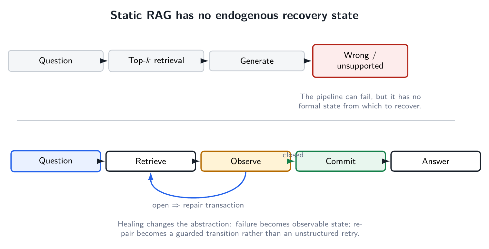

The difference is not that a healing system retries more aggressively. The difference is that the system can answer four questions before it mutates anything:

1. **What exactly is wrong with the current evidence?**
2. **What repair action is allowed to change?**
3. **What makes the proposed evidence state better than the current one?**
4. **If it is not better, how do we return to the last valid state?**

The protocol therefore changes the operational map. Instead of treating retrieval as a one-time precondition, it treats evidence as a state variable:

`(q, E_t, ρ_t) → (E_{t+1}, ρ_{t+1})`.

The crucial symbol is not the arrow. It is the fact that the state on each side of the arrow can be inspected, compared, logged, accepted, or rejected.

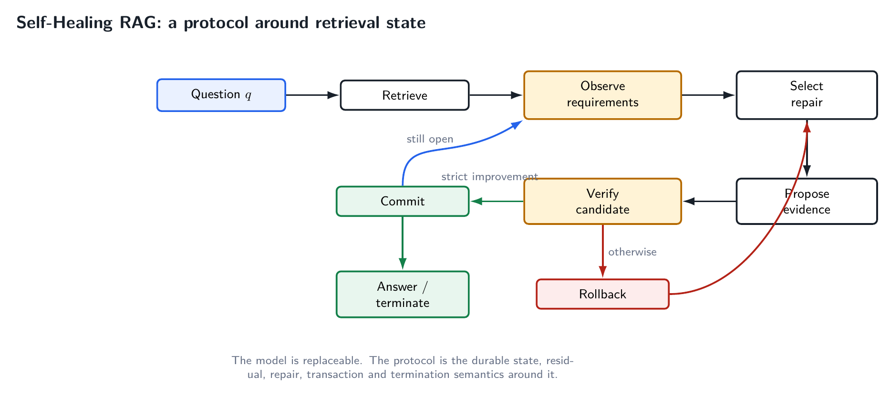

This immediately separates the project from model-centric approaches. A better generator may reduce the number of failures. It does not, by itself, define the semantics of a failed retrieval state.

## 2. The state must survive the prompt

For a question `q`, the v0.1 protocol uses an operational state

`s = (q, E, R, h, τ)`.

The symbols have simple meanings:

- `q` is the immutable question.
- `E` is the currently active evidence.
- `R` is a frozen vector of evidence requirements.
- `h` stores signatures of previously visited evidence states.
- `τ` is the durable transaction history.

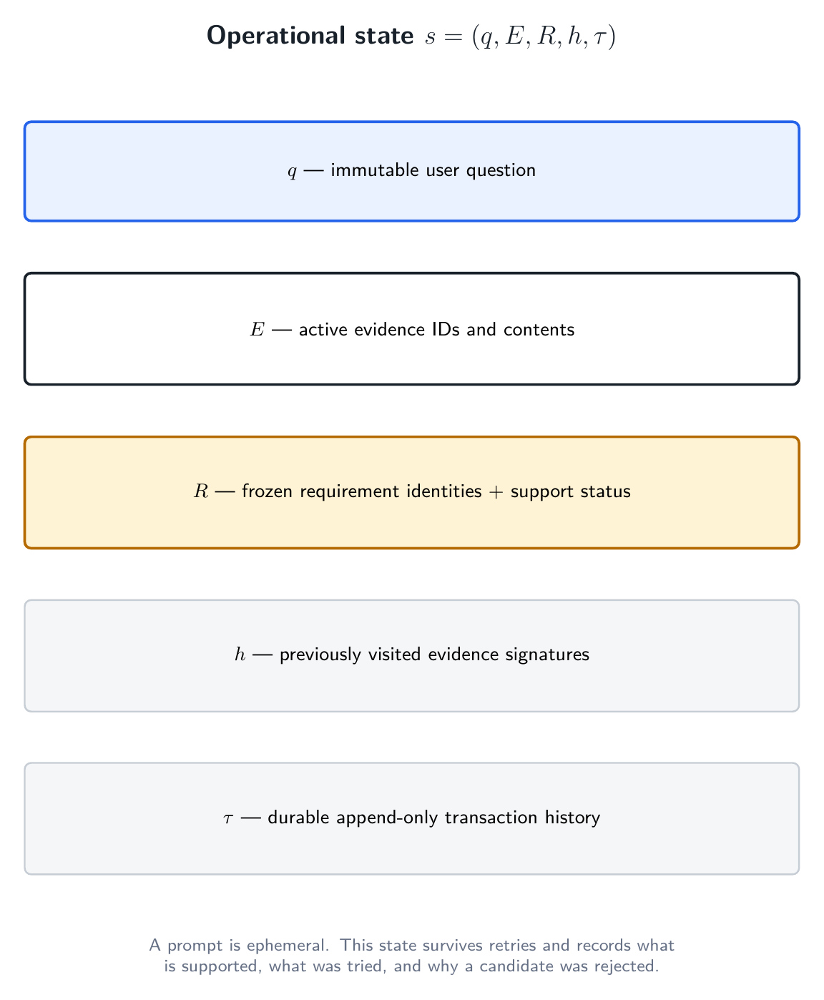

This state is deliberately richer than a prompt. A prompt is a serialization sent to a model. It is not, by itself, the system's durable memory. Once a prompt is regenerated, the system may no longer know which earlier evidence was protected, which proposal failed verification, or whether the current evidence set has appeared before.

A self-healing controller needs those facts to remain true across retries and even across interrupted runs. That is why checkpoints and transaction logs are part of the architecture rather than an observability afterthought.

The state also makes terminal semantics precise. A state can be **closed** when every requirement is supported. It can be **open-missing** when at least one required fact is absent. It can be **open-uncertain** when the evidence is relevant but ambiguous or incomplete. Later, if repair cannot make progress, the state can terminate as insufficient, stagnated, cycled, or technically failed.

That taxonomy matters because “the LLM did not answer” is not a diagnosis. A missing operand, an ambiguous unit, a repeated retrieval state, and a parser failure require different handling.

## 3. Requirements make retrieval sufficiency query-specific

A top-`k` list is not intrinsically sufficient or insufficient. Sufficiency depends on what the question requires.

Consider a percentage-change question. The system may need:

- the old value,
- the new value,
- the correct period for each,
- the scale or unit,
- and sometimes the direction in which the change is requested.

A retrieved chunk can be highly similar to the question while containing only one of those items. If the controller reduces the entire question to a scalar similarity score, that failure is hard to represent.

The protocol instead represents a question as a vector of requirements `R = (r1, …, rm)`. Requirement identities are frozen during a transaction. A verifier can update whether a requirement is supported, uncertain, or missing, and which evidence supports it, but a candidate repair cannot silently rewrite the task into an easier one.

That restriction is more important than it looks. If the requirement definition itself changes after seeing a candidate, then “improvement” becomes meaningless. A system can appear to reduce failure simply by changing what it claims to need.

## 4. The residual is deliberately primitive

Each requirement has one of three costs:

- supported → `0`
- uncertain → `1`
- missing → `2`

The residual is the sum:

`ρ(s) = Σ c(zi)`.

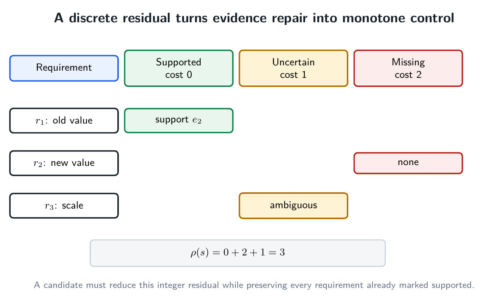

This is not a learned reward, not a probability, and not a confidence score. It is a small integer that counts unresolved evidence severity.

That simplicity is useful for three reasons.

First, the controller does not need the gold answer to measure progress. Gold labels remain outside the operational loop. The controller only needs the question, the current evidence, the frozen requirements, and the verifier's support judgments.

Second, partial progress becomes visible. Recovering one missing operand can reduce the residual even if the question is not yet answerable. A binary “success/failure” signal would throw that information away.

Third, strict descent gives the controller a well-founded objective. If every committed repair reduces a non-negative integer, an infinite sequence of committed improvements is impossible.

The proof-of-concept produced exactly this kind of audit trail. Across the main development retrieval stages, aggregate residual moved

`2383 → 1607 → 1064 → 915`.

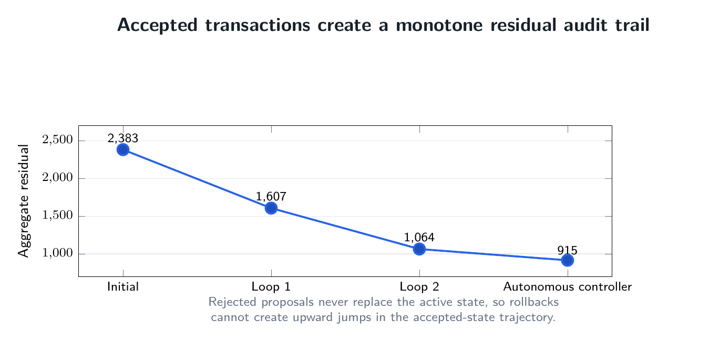

The important point is not that those particular numbers are universal. The important point is that an accepted transition has a formal interpretation: it moved the durable system to a lower-residual state.

## 5. A repair is a transaction

A repair attempt is represented as

`T = (s, a, p, v, d, s*)`,

where `s` is the durable state, `a` the chosen action, `p` a tentative proposal, `v` the verification result, `d` the commit/rollback decision, and `s*` the durable state after the transaction.

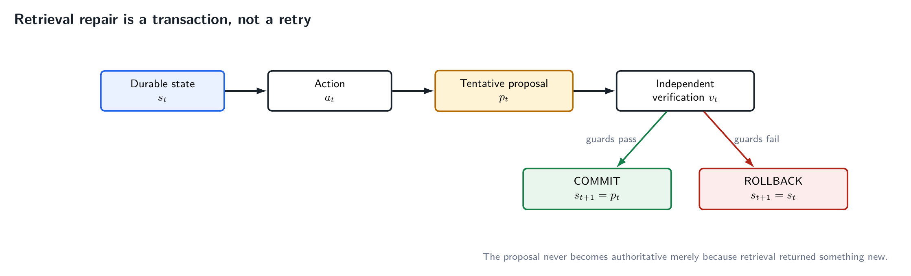

The candidate evidence does **not** become active merely because a retriever returned it. It remains tentative until verification finishes.

This is the most important systems distinction in the project.

A generic retry says: “try something else.” A transaction says: “construct a candidate, evaluate it against invariants, and allow it to replace the current state only if it earns that right.”

That creates a safe boundary around aggressive repair. The controller is free to rewrite a query, search lexically, expand within a source document, or try another retrieval strategy because a failed experiment does not have to corrupt the durable evidence state.

The implementation records these transactions durably. That is useful for debugging, but more importantly it makes the architecture auditable. A reader can ask why a state changed and distinguish an accepted improvement from a rejected proposal.

## 6. Lower residual is necessary, but not sufficient

Suppose a candidate reduces the residual by finding a missing number, but in doing so it evicts the only chunk that supported a different requirement. The aggregate residual can improve while the system silently forgets something it already knew.

The commit rule therefore contains two guards:

`commit(s → s') iff ρ(s') < ρ(s) and S(s) ⊆ S(s')`,

where `S(s)` is the set of requirement identities already supported in the current state.

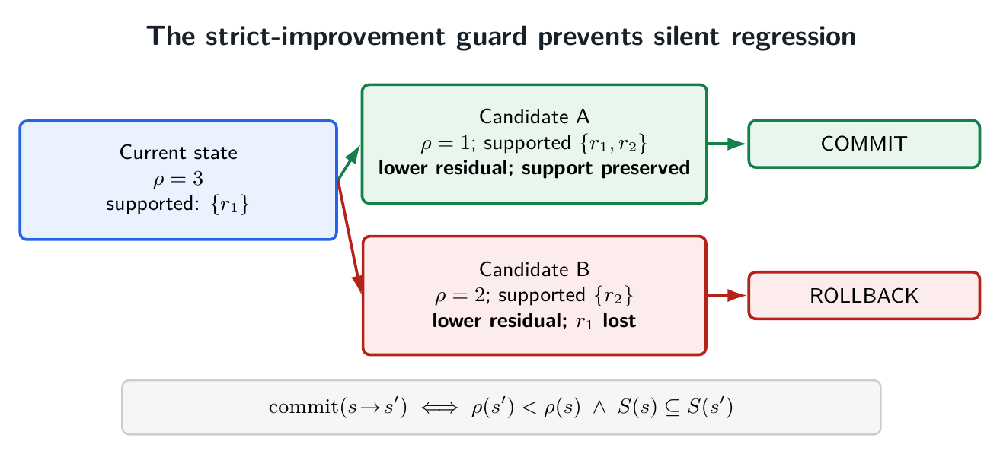

The first clause requires strict residual improvement. The second protects previously supported requirements.

This turns evidence preservation into a semantic invariant rather than a top-`k` heuristic. A particular evidence item is not sacred forever. It may be replaced, but only if the candidate state still supports what was already supported.

That distinction matters in iterative retrieval. New queries can reorder the ranking and repeatedly destroy a useful operand while recovering another. Without protected support, a controller can oscillate between complementary partial answers.

## 7. Rollback is normal

In many machine-learning demos, a retry is implicitly expected to help. The transaction view removes that optimism from the control rule.

In the v0.1 development lineage, the first requirement-targeted repair stage committed 323 proposals and rolled back 442. A later document-local stage committed 233 and rolled back 345.

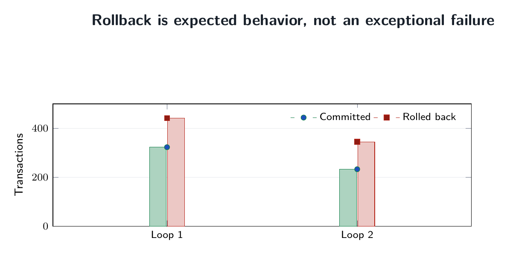

Those rollback counts are not evidence that transactionality failed. They are evidence that transactionality was actually being enforced.

A system that accepts every new retrieval result is not healing. It is mutating.

This is especially important for RAG because retrieval actions are cheap to propose and easy to over-trust. Semantic search will almost always return *something*. The existence of a result is therefore a poor reason to overwrite the current context.

The protocol treats a candidate as guilty until verified useful.

## 8. Repair actions should be bounded and ordered by cost

The proof-of-concept accumulated several repair operators during development: requirement-targeted semantic search, document-local retrieval, exhaustive lexical search, rewritten semantic queries, evidence expansion, and specialist answer solving.

Those operators do not cost the same amount.

One of the strongest lessons from the experiment was that language-model calls should not be treated as generic control-flow operations. Asking a 7B model to observe, rewrite, re-observe, verify, repair, and solve in separate calls may make the logic explicit, but it can make the system unusably slow.

A practical controller should therefore have a bounded action set and a cost ladder. Cheap deterministic actions should dominate early repair. Expensive semantic inference should occur only when it adds information that deterministic code cannot recover cheaply.

That observation becomes central when we look at validation runtime later.

## 9. A healing loop must know when it is cycling

A closed loop without cycle semantics is just an infinite-loop opportunity.

The v0.1 controller stores signatures of evidence states. In the simplest form,

`σ(E) = (id(e1), …, id(ek))`.

If a proposal recreates a previously visited evidence signature, that branch is rejected instead of executed again.

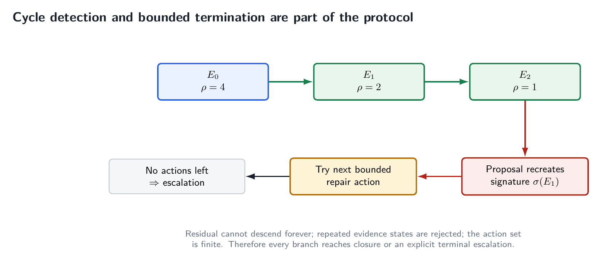

Exact ID signatures do not capture every semantic cycle, but they prevent the most operationally dangerous form: repeatedly reconstructing the same evidence state while believing the system is still searching.

Cycle detection was not merely theoretical in the development run. The bounded escalation stage recorded 220 cycle terminations. The system also distinguished stagnation, corpus insufficiency, and technical failure.

This is an important design choice: **failure to heal is itself a valid terminal result**.

Autonomous systems need permission to stop. Otherwise “self-healing” can become an excuse for unbounded computation followed by an answer that was never actually verified.

## 10. Why the protocol terminates

The termination argument is small but useful.

1. The residual is a non-negative integer.
2. Every committed transition strictly reduces it.
3. Repeated evidence states are rejected.
4. The repair action set is bounded.

Therefore a branch cannot contain infinitely many committed improvements, and it cannot continue forever by cycling through the same finite repair states. Eventually it reaches closure or an explicit terminal escalation.

The proof-of-concept later included a separate **best-effort terminal resolver** so that every validation question had a prediction for benchmark scoring. The repository labels those predictions separately. A best-effort terminal answer is not retroactively called a verified commit.

That distinction is essential. Evaluation coverage and protocol-level closure are different quantities.

## 11. The worked implementation: financial document QA

The protocol needs a domain in which retrieval insufficiency is common enough to exercise repair. The proof-of-concept uses a strict local financial-document corpus derived from the TAT-DQA/TAT-QA setting.

The frozen corpus contains:

- 277 documents,
- 1,599 questions,
- 14,542 total units,
- 3,838 active searchable paragraph and table-row evidence records.

The question split is document-disjoint: 963 development questions, 312 validation questions, and 324 test questions.

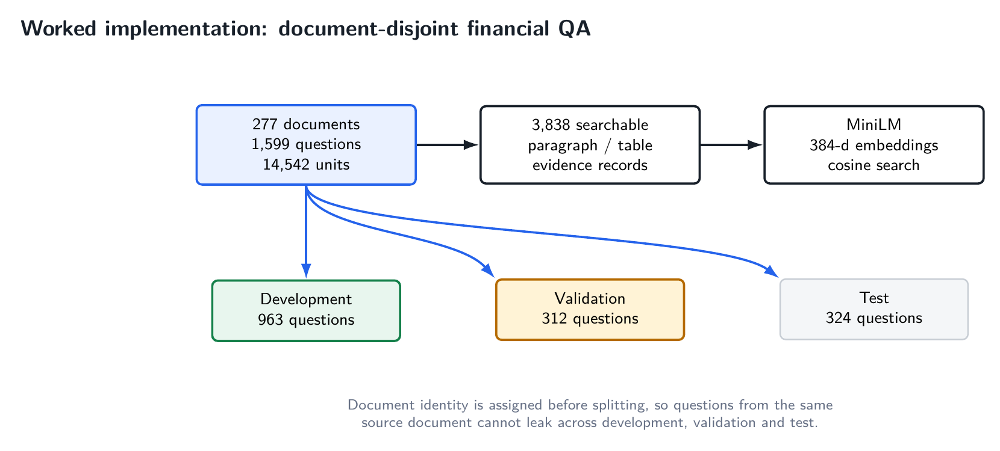

That split is not cosmetic. Document-local repair is allowed to use source-document identity. If the same document appeared in both development and validation, tuning document-local behavior could leak structure across the boundary.

The reference implementation uses `sentence-transformers/all-MiniLM-L6-v2` embeddings and a persistent Chroma store. The generator in v0.1 is Qwen2.5-7B-Instruct running locally in 4-bit NF4 quantization on an RTX 4060 laptop GPU with 8 GB VRAM.

Those choices are implementation details, not protocol requirements. They matter because they show that the control architecture can be exercised with modest local hardware rather than a proprietary hosted model.

## 12. The initial retrieval state is genuinely incomplete

The benchmark is useful because top-5 retrieval is not a near-perfect starting point.

At top-5:

- requirement recall is 45.80% on development, 46.37% on validation, and 42.20% on test;
- any-evidence rate is 51.19%, 52.88%, and 50.00%;
- full-evidence rate is 48.49%, 48.40%, and 46.60%.

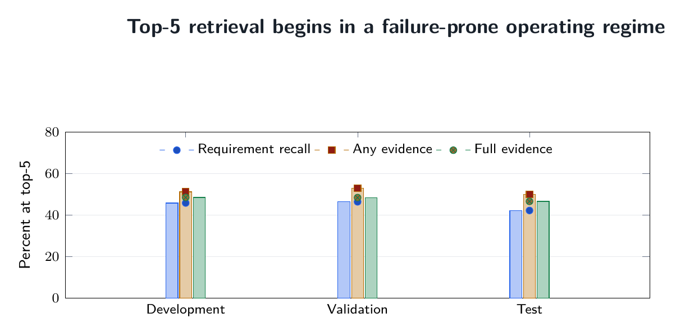

In other words, roughly half the questions enter generation without complete evidence at the operating retrieval depth.

That is the operating regime the protocol is meant for. A healing loop is not especially interesting if retrieval almost always starts in a closed state.

The distinction between **any evidence** and **full evidence** is also important. A retrieval system can find a relevant passage and still fail the question because one required operand, scale, or period is absent. RAG evaluation that treats “some relevant evidence exists” as sufficient can miss exactly the failure mode the requirement vector exposes.

## 13. What the development loops actually did

The v0.1 lineage intentionally preserves the path by which the controller was built.

The first major loop targeted unresolved requirements with semantic retrieval. Candidates were re-observed against the frozen requirements and committed only if they passed the improvement contract. This reduced residual from 2,383 to 1,607.

The second loop changed the repair boundary from global retrieval to source-document-local retrieval. Financial questions often require nearby table rows or paragraphs from the same document even when global embedding rank is weak. This stage reduced residual further to 1,064.

The autonomous retrieval controller then selected repair actions from machine state without a human routing gate. It started with 557 closed and 406 open development cases, closed 29 more, and reduced residual from 1,064 to 915. At that point the remaining retrieval failures were increasingly resistant to more of the same repair.

That diminishing return is useful. A self-healing system should not interpret every unresolved case as evidence that it needs another agent. Sometimes the correct result is that the current repair family is exhausted.

## 14. Generation is another controlled transition

Even perfect retrieval does not make generation trustworthy.

The v0.1 system therefore subjected answer generation to verification and bounded repair rather than automatically committing the first generated answer. This exposed a second class of failure: **contract failure**.

Structured LLM outputs can be semantically useful and syntactically unusable. The observer, for example, initially produced strict JSON and generated a number of parser failures. Later recovery showed that many of those cases were not semantic failures at all.

That distinction matters because serialization errors should not be treated as evidence insufficiency. One of the engineering lessons of v0.1 is to keep model output contracts as small as possible and move deterministic checks out of natural-language conversations.

This lesson directly motivates the compact v0.2 path.

## 15. Validation made the bottleneck impossible to ignore

The 312-question validation split was run without feeding gold answers back into the controller. Gold remained quarantined until predictions were frozen.

A practical bounded validation path first gave Qwen only the initial top-5 evidence. The model either produced an answer or emitted the literal signal `RETRIEVE`.

That first stage answered 39 questions and routed 273 to healing. It took about 2 hours 26 minutes on the local RTX 4060.

The second stage expanded same-document evidence and called Qwen again only on those 273 cases. It took about 2 hours 53 minutes. The result was sobering: only **one additional verified commit**. The other 272 cases were escalated.

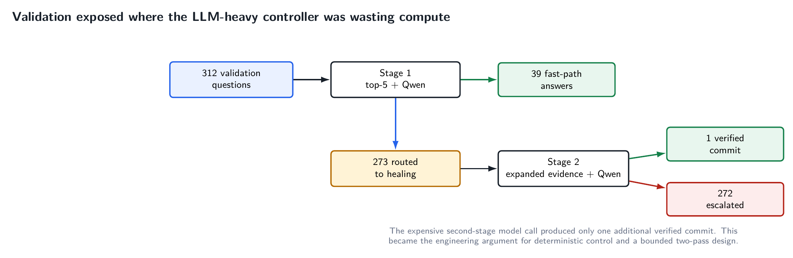

This is exactly the kind of result that should change an architecture.

The wrong response would be to add more prompts to the same expensive control loop. The useful response is to ask which decisions actually need a generative model.

## 16. The fastest stage changed the design direction

The final best-effort resolver preserved already obtained answers, operated only on the 272 unresolved cases, assembled compact same-document evidence deterministically, and used one short Qwen call per unresolved case.

It processed those 272 cases in 15.82 minutes, roughly 3.55 seconds per case.

For comparison:

- validation Stage 1: 25.45 seconds per case,
- validation Stage 2: 36.29 seconds per healing case,
- terminal resolver: 3.55 seconds per case.

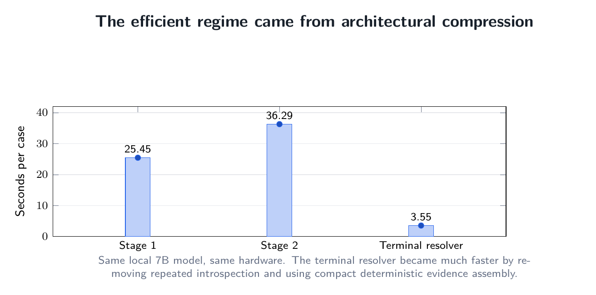

The model did not suddenly become ten times smarter. The architecture stopped asking it to perform so many control functions.

That is the central engineering result of v0.1.

The proof-of-concept was valuable precisely because it made the expensive machinery explicit enough to show which parts should later become deterministic.

## 17. What v0.1 achieved — and what it did not

After the terminal resolver, the POC contained a prediction for all 312 validation questions. The frozen release metrics are:

- normalized exact match: **0.2660**,
- mean token F1: **0.5546**,
- accumulated Qwen calls across the v0.1 validation lineage: **857**, or 2.747 per question.

These are not state-of-the-art QA results, and the repository does not present them as such.

The purpose of v0.1 is different. It establishes a complete autonomous control proof of concept and preserves its failures. It shows that:

- retrieval state can be made explicit and durable;
- progress can be measured without gold-label feedback;
- repair proposals can be independently accepted or rejected;
- previously supported evidence can be protected;
- cycles and terminal escalation can be formal runtime states;
- the same architecture can recover from its own structured-output and execution failures;
- and the expensive parts of the control graph can be identified empirically rather than guessed.

The weakness of the benchmark score is therefore not hidden. It is a baseline from which later implementations must improve while preserving the protocol semantics.

## 18. The compressed v0.2 implementation

The next implementation direction keeps the protocol but drastically reduces the semantic model call graph.

The hot path is:

`deterministic document-local hybrid retrieval → Qwen pass 1 → deterministic verifier`.

Only if deterministic verification fails does the system perform:

`automatic evidence expansion → Qwen pass 2 → deterministic verifier`.

Then it either commits or terminates with an explicit best-effort/escalation status.

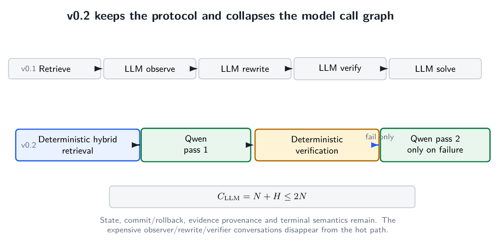

There is no human routing gate, no Qwen observer conversation, no Qwen verifier conversation, no Qwen query-rewrite conversation, and no unbounded iterative repair loop.

If `N` is the number of questions and `H ≤ N` is the number that fail after the first solve, the semantic solve-call count is bounded by

`C_LLM = N + H ≤ 2N`.

The retriever in the from-scratch implementation combines document-local dense and lexical evidence with reciprocal-rank fusion. The verifier checks grounding and safely executes arithmetic expressions where applicable. The second model pass exists only for failed first-pass verification.

This is an implementation simplification, not a redefinition of self-healing. The durable ideas remain state, residual, guarded repair, provenance, commit/rollback, and terminal semantics.

## 19. Protocol versus implementation

This distinction is worth stating explicitly because it determines where the project belongs.

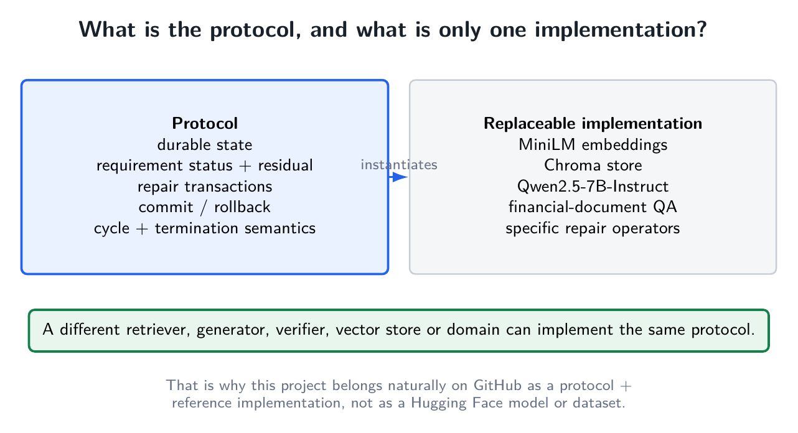

The **protocol** consists of things such as:

- durable evidence state,
- requirement status,
- a progress objective or residual,
- repair transactions,
- independent commit guards,
- rollback,
- history/cycle semantics,
- and bounded terminal outcomes.

The **reference implementation** happens to use:

- MiniLM embeddings,
- Chroma,
- Qwen2.5-7B-Instruct,
- financial-document QA,
- and a particular set of retrieval repair operators.

Any of those implementation choices can change without destroying the protocol. A future implementation could use a sparse retriever, a different dense encoder, another vector store, a smaller verifier model, a hosted generator, a biomedical corpus, or no vector database at all.

That is why packaging this project as a Hugging Face “model” would be misleading. There are no newly trained model weights that embody the contribution. Packaging it as a “dataset” would be even more misleading. The corpus used by the implementation is an experimental substrate, not the project itself.

GitHub is the natural primary home because the artifact is a **protocol + executable reference implementation + audit trail**.

## 20. Relation to adaptive and corrective RAG

The phrase “self-healing RAG” is not claimed as new. Nor is the project claiming to be the first system that adapts retrieval or corrects itself.

Several important predecessors already establish those ideas:

- Lewis et al.'s original RAG formulation couples retrieval with generation for knowledge-intensive NLP: <https://arxiv.org/abs/2005.11401>
- FLARE performs active retrieval during generation: <https://arxiv.org/abs/2305.06983>
- Self-RAG trains a model to retrieve, generate, and critique using reflection tokens: <https://arxiv.org/abs/2310.11511>
- CRAG explicitly evaluates retrieval and triggers corrective actions: <https://arxiv.org/abs/2401.15884>

The present project takes a systems route. Rather than making reflection itself the defining object, it externalizes the control semantics into persistent state.

The scoped claim of the v0.1 repository is therefore **transactional self-healing**: requirement state, discrete residual, strict commit/rollback, durable transaction history, cycle handling, and bounded escalation jointly define the recovery process.

This is a narrower claim than “first corrective RAG,” and that narrowness is intentional. It makes the architecture falsifiable and comparable.

## 21. Why transactionality is useful beyond this implementation

The transaction abstraction has several properties that generalize well.

### It separates exploration from activation

A retrieval system can search aggressively without making every search result authoritative. That permits broad repair policies while preserving a trusted durable state.

### It makes regression visible

The support-preservation guard prevents a new candidate from silently solving one requirement by forgetting another.

### It creates an audit trail

Every accepted state change has a reason. Every rejected candidate remains evidence about what the controller tried.

### It enables restart semantics

Because state and transaction history are durable, an interrupted execution does not need to rediscover which actions were already attempted.

### It gives termination a mathematical shape

A well-founded residual plus cycle memory and a finite action set is enough to rule out the most obvious forms of endless autonomous repair.

### It decouples control from any one model

The generator can improve, shrink, or change vendors without redefining the commit semantics.

These are ordinary systems properties. That is precisely the point. Reliable RAG needs more ordinary systems engineering around the extraordinary model.

## 22. What I would measure next

Once the protocol is fixed, the next research questions become much cleaner.

First, **how much verified accuracy can be obtained per model call?** The v0.1 validation run showed that a logically elaborate controller can still have terrible economics if every branch re-enters a large autoregressive model.

Second, **which residuals can be computed deterministically?** Arithmetic consistency, units, cited-number provenance, schema constraints, and many retrieval coverage checks do not necessarily need an LLM conversation.

Third, **which repair action has the best expected residual reduction per unit cost?** That turns controller design into a measurable policy problem rather than a collection of prompt intuitions.

Fourth, **how often does protected evidence prevent regression?** This can be evaluated directly by comparing guarded and unguarded repair trajectories.

Fifth, **how much of the protocol transfers across domains?** Financial QA makes requirements relatively natural because missing operands and units are easy to name. Biomedical QA, legal retrieval, software documentation, and enterprise search will stress different requirement representations.

Finally, **what should constitute semantic cycle equivalence?** Exact evidence-ID signatures are operationally useful but conservative. A stronger implementation can canonicalize support state or detect semantically equivalent evidence configurations.

Those are protocol-level questions. They remain meaningful even if the underlying LLM changes every six months.

## 23. The point

Self-Healing RAG is not an argument that every RAG system needs a swarm of agents. The v0.1 measurements actually suggest the opposite.

The project begins with a more basic claim: when retrieval can fail, the system needs explicit semantics for what happens next.

The five persistent ideas are:

**state → residual → repair → transaction → termination.**

The first implementation made those ideas visible with an intentionally explicit controller. The resulting runtime measurements then showed where that controller was too model-heavy. The next implementation compresses the hot path while retaining the same safety boundary.

That is the useful separation.

A model generates. A retriever searches. A verifier checks. A database stores. **The protocol decides when the system is allowed to change its mind.**

---

### Project links

Protocol / v0.1 proof of concept: <https://github.com/AngshulMajumdar/Self-Healing-RAG>

Compact v0.2 implementation direction: <https://github.com/AngshulMajumdar/Self-Healing-RAG-V2>

The repository intentionally preserves the full development lineage, frozen validation metrics, formal specification, and the distinction between verified commits and terminal best-effort benchmark predictions.
